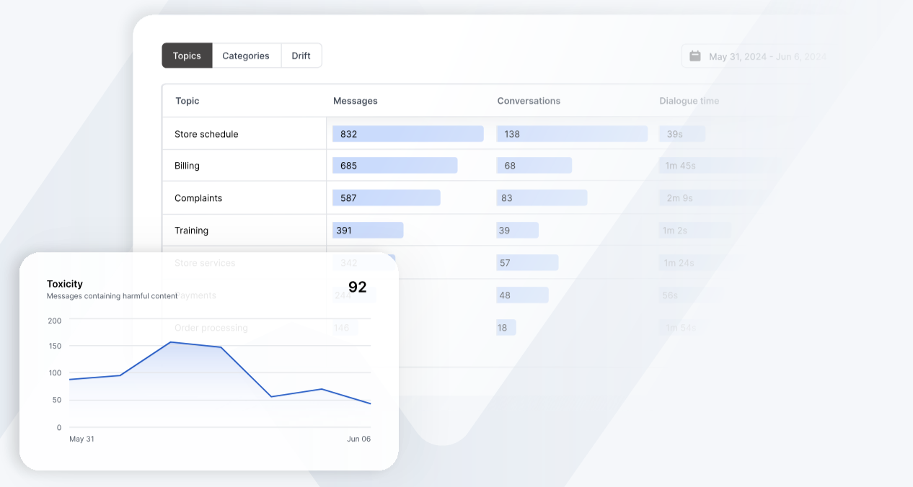

# Analytics

The Analytics dashboards provides comprehensive insights into your LLM endpoint performance, usage patterns, and security metrics. This powerful observability tool helps you monitor and optimize your AI applications across multiple dimensions.



## Metrics

NeuralTrust provides a wide range of metrics to help you monitor and optimize your LLM endpoint.

### Usage Metrics

Track your LLM endpoint utilization through key metrics to optimize resource allocation and understand usage patterns:

- **Total messages processed**: Monitor your application's scale and growth
- **Number of active conversations**: Understand concurrent usage and user engagement
- **Response generation time**: Track how fast your LLM responds to user queries
- **Usage patterns over time**: Identify trends and cyclical patterns
- **Peak usage periods**: Prepare for high-demand situations
- **API call frequency**: Monitor integration health and usage patterns

### Topic Classification Metrics

Understand conversation patterns and user needs through automated topic analysis:

- **AI-generated topic clusters**: Automatically group similar conversations
- **Conversation theme distribution**: Visualize popular discussion topics
- **Most common use cases**: Identify primary user needs
- **Topic trend analysis**: Track changing user interests over time
- **Custom topic mapping**: Define and track specific topics of interest

### System Performance Metrics

Monitor and optimize your LLM deployment's technical aspects:

- **Cost per request**: Track financial efficiency
- **Average latency**: Monitor response speed
- **Token usage statistics**: Optimize prompt and response efficiency
- **Model performance metrics**: Track accuracy and quality
- **Error rates and types**: Identify and fix issues
- **Resource utilization**: Monitor system efficiency

### User Metrics

Understand user behavior and improve engagement:

- **Active users count**: Track user adoption and retention
- **Session duration statistics**: Understand user engagement depth
- **User engagement metrics**: Measure interaction quality
- **Return user rates**: Monitor user loyalty
- **Platform/device usage**: Optimize for different platforms

### Security Metrics

Protect your LLM deployment and ensure safe usage:

- **Jailbreak attempt detection**: Identify security threats
- **Content moderation flags**: Maintain appropriate content
- **Blocked request patterns**: Understand security threats
- **Security incident trends**: Track security health

### Sentiment Metrics

Track emotional context and user satisfaction:

- **Message sentiment scoring**: Understand user emotions
- **Sentiment trends over time**: Monitor changing user attitudes
- **Emotional content analysis**: Understand user emotional states
- **User satisfaction indicators**: Track experience quality
- **Response sentiment matching**: Ensure appropriate emotional responses
- **Conversation tone metrics**: Monitor interaction quality

### Accessibility Metrics

Ensure your LLM is accessible and understandable:

- **Message complexity scores**: Monitor response clarity
- **Language level assessment**: Ensure appropriate communication level


## How to create a Custom Topic Classifier?

Custom topic classifiers help you categorize conversations based on your specific business needs.

### Managing Classifiers

- **Create new classifier**:
  - Go to **Topics** → **Manage Topics** → **Create Topic Classifier**

- **Update existing classifier**:
  - Go to **Topics** → **Manage Topics** → Click classifier name

### Setup and Configuration

- **Name and Scope**
  - Choose a descriptive name
  - Set reach: responses, answers, or both

- **Classification Type**
  - Unique label: one category per conversation
  - Multilabel: multiple categories allowed
  - Numerical: for scoring or ratings

- **Domain and Classes**
  - Define your use case (e.g., "AI customer support assistant for an e-commerce platform handling product inquiries, order management, returns, and technical support for our online shopping website and mobile app")
  - Add classes with detailed descriptions:
    ```
    Class: Product Information
    Description: Questions about product specifications, availability, pricing, comparisons, and compatibility. Includes inquiries about new arrivals, product features, and stock availability across different locations.

    Class: Order Management
    Description: Queries related to placing orders, tracking shipments, modifying existing orders, and order cancellations. Also covers payment processing issues and delivery timeframe questions.

    Class: Returns & Refunds
    Description: All conversations about product returns, refund policies, return shipping labels, refund status, and exchange procedures. Includes warranty claims and damaged item reports.

    Class: Technical Support
    Description: Website navigation issues, mobile app troubleshooting, account access problems, checkout errors, and payment gateway technical difficulties. Also covers password resets and account security concerns.

    Class: Customer Feedback
    Description: Product reviews, service quality feedback, improvement suggestions, and general comments about the shopping experience. Includes both positive feedback and complaints.
    ```

- **Save** your changes when done


> **Note**: Clear class descriptions ensure better classification accuracy.

