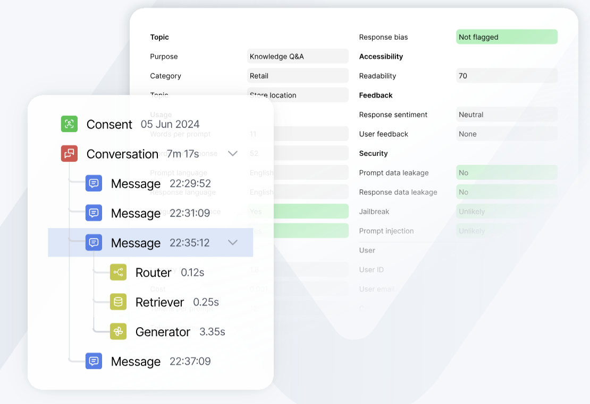

# Tracing

Comprehensive tracing capabilities for monitoring and debugging your LLM applications.



## Why Trace LLM Applications?

LLM applications can be complex systems with many moving parts - from prompt construction and context retrieval to tool usage and response generation. When something goes wrong or behaves unexpectedly, it can be challenging to understand exactly what happened. Tracing provides:

- **Debugging Clarity**: See exactly how your LLM processed a request, what context it used, and how it arrived at its response
- **Performance Insights**: Identify bottlenecks in your application, like slow API calls or expensive retrievals
- **Quality Monitoring**: Track the quality of LLM outputs and user satisfaction over time
- **Compliance & Auditing**: Maintain detailed records of all LLM interactions for compliance requirements
- **Cost Optimization**: Understand which parts of your system are making the most LLM calls and optimize accordingly

## Overview

The tracing system captures detailed information about your LLM application's behavior and performance. This includes:

- **Message flows**: Track the complete conversation flow between users and your LLM, including intermediate steps
- **Tool usage**: Monitor when and how your LLM uses external tools, APIs, and function calls
- **Agent interactions**: Record agent reasoning steps, decisions, and actions taken
- **Data retrievals**: Track RAG operations, document fetches, and context augmentation
- **Response generations**: Capture prompt construction, LLM calls, and response processing
- **System events**: Log infrastructure events, errors, and runtime information
- **Custom events**: Define and track application-specific events important to your use case
- **User feedback**: Collect explicit ratings, implicit signals, and interaction outcomes

## Basic Usage

Create a trace and add events:

```python
# Initialize a trace
trace = client.trace(
    conversation_id="conv_123",
    session_id="session_123"
)

# Add a message event
message = trace.message("User: What's the weather?")
message.end("Bot: It's sunny!")
```

## Event Types

Each event type serves a specific purpose in tracking your LLM application's behavior:

### MESSAGE
Root-level conversation events that capture the main interaction flow. Use these to track the overall conversation structure.

```python
message = trace.message("User input")
message.end("Bot response")
```

### TOOL
Tracks external tool and API usage. Perfect for monitoring function calls, database queries, or any external service interactions.

```python
tool = message.tool("Calling weather API")
tool.end("API response received")
```

### GENERATION
Captures LLM prompt construction and response generation. Use this to monitor token usage, response quality, and generation parameters.

```python
generation = message.generation("Generating response")
generation.end("Response generated")
```

### AGENT
Records agent reasoning steps and decisions. Useful for understanding how your LLM agent processes tasks and makes choices.

```python
agent = message.agent("Planning next action")
agent.end("Decided to search database")
```

### RETRIEVAL
Monitors document retrievals and RAG operations. Tracks what context was fetched and how it was used.

```python
retrieval = message.retrieval("Searching knowledge base")
retrieval.end("Found 3 relevant documents")
```

### SYSTEM
Captures infrastructure events and runtime information. Use for monitoring system health and performance.

```python
system = trace.system("Initializing cache")
system.end("Cache warmed up")
```

### FEEDBACK
Records user feedback and interaction outcomes. Essential for quality monitoring and improvement.

```python
trace.feedback(
    feedback_tag="THUMBS_UP",
    feedback_text="User marked response as helpful"
)
```

## Advanced Tracing Features

### Nested Tracing
Nested tracing is the recommended way to track complex interactions in your LLM application. It creates a hierarchical structure that makes it easy to understand the relationship between different operations:

```python
# Initialize trace with basic context
trace = client.trace(
    conversation_id="conv_123",
    metadata=Metadata(environment="production"),
    user=User(id="user_123")
)

try:
    # Start main conversation trace
    message = trace.message("User: Tell me about neural networks")
    
    # Track document retrieval
    retrieval = message.retrieval("Searching documentation")
    retrieval.end("Found 2 relevant articles")
    
    # Track response generation
    generation = message.generation("Creating explanation")
    generation.end("Generated response about neural networks")
    
    # Complete the conversation
    message.end("Bot: Neural networks are...")

except Exception as e:
    message.end(f"Error: {str(e)}")
```