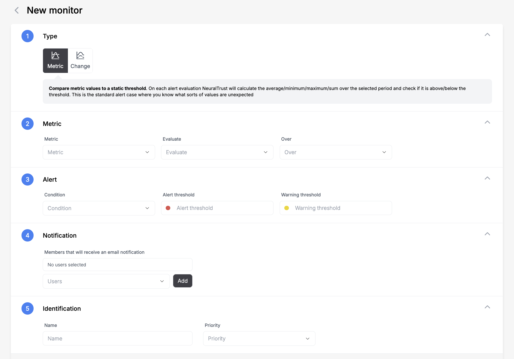

# Monitors

Configure and manage monitors through the NeuralTrust platform to track key metrics and receive alerts for your LLM applications.

## Creating a Monitor



### 1. Type
Select the type of monitor:
- **Metric** (Métrica): Compare metric values against a static threshold
- **Change** (Cambio): Monitor metric changes over time

> **Note**: For metric type, NeuralTrust will calculate the average/minimum/maximum/sum during the selected period and verify if it's above/below the threshold. This is the standard alert case where you know the expected values.

### 2. Metric
Configure the metric settings:

- **Metric** (Métrica): Select the metric to monitor
  - Messages (Mensajes)
  - Conversations (Conversaciones)
  - Dialog Time (Tiempo de diálogo)
  - Words per prompt (Palabras por prompt)
- **Evaluate** (Evaluar): Choose evaluation method
- **During** (Durante): Select time window

### 3. Alert
Set up alert conditions:

- **Alert Threshold** (Umbral de alerta): Critical threshold value
- **Warning Threshold** (Umbral de advertencia): Warning threshold value

### 4. Notification
Configure alert notifications:

- **Email Recipients** (Miembros que recibirán una notificación por correo electrónico)
- Click "Add" (Añadir) to include team members

### 5. Identification
Add monitor details:

- **Name** (Nombre): Enter monitor name
- **Priority** (Prioridad): Set monitor priority level

## Actions

- **Save** (Guardar): Create the monitor
- **Cancel** (Cancelar): Discard changes

## Best Practices

1. **Threshold Setting**
   - Start with conservative thresholds
   - Base thresholds on historical data
   - Monitor and adjust as needed

2. **Notifications**
   - Add relevant team members
   - Avoid alert fatigue
   - Keep recipient list updated

3. **Monitoring**
   - Review alert effectiveness
   - Adjust thresholds as needed
   - Archive unused monitors
``` 
