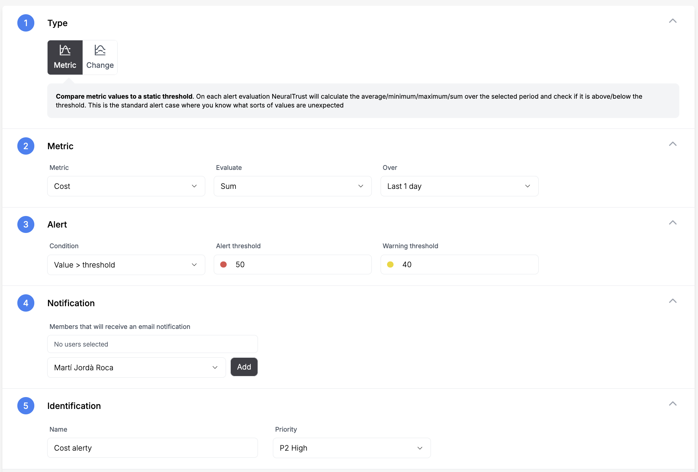

# Monitors

Monitoring LLM applications is essential for maintaining performance, controlling costs, and ensuring quality. Through the NeuralTrust platform, you can track key metrics and receive alerts when issues arise.

## Types of Monitors

### Metric Monitor
Metric monitors compare metric values against a static threshold. During each alert evaluation, NeuralTrust calculates the selected metric over the selected period and checks if it's above/below the threshold. This is the standard alerting case where you know what unexpected values look like. 

For example, you might want to be alerted when the average response time exceeds 5 seconds or when the total cost goes above a certain budget threshold.

### Change Monitor
Change monitors evaluate the difference between a past value and the current value. During each alert evaluation, NeuralTrust calculates the difference between the current series and the series from N minutes ago, then computes the selected metric over the selected period. An alert is triggered when this computed series crosses the threshold. 

This type of monitor is particularly useful for detecting sudden changes in your metrics, such as an unexpected spike in error rates or a significant drop in successful completions.

## Getting Started

The fastest way to get started with NeuralTrust monitors is through implementing one of the following recommended monitors.

### Cost Monitor

This monitor tracks the total accumulated cost of your LLM application on a daily basis. It uses the sum of all costs over a 24-hour rolling window to help you maintain budget control.

The monitor calculates the total cost over a 1-day window and triggers when:
- Alert: The total daily cost exceeds $50
- Warning: The total daily cost exceeds $40

This is particularly useful for:
- Budget control and cost optimization
- Detecting unexpected cost spikes
- Preventing budget overruns
- Identifying potentially expensive patterns in your LLM usage

To configure this monitor select the following options:
- *Type:*
    - Metric Monitor
- *Metric:*
    - Metric: Cost
    - Evaluate: Sum
    - Over: Last 1 day
- *Alert:*
    - Condition: Value > threshold
    - Alert threshold: 50
    - Warning threshold: 40
- *Identification:*
    - Name: Cost Monitor
    - Priority: P2 High

### Negative Sentiment Monitor

This monitor tracks changes in the sentiment of responses from your LLM application over time. It's designed to detect significant deterioration in response sentiment by comparing recent sentiment scores against historical data.

The monitor will trigger when there's a substantial negative shift in sentiment compared to the baseline period. Specifically, it:
- Calculates the average sentiment over the last hour
- Compares it to the average sentiment from the previous 4 hours
- Triggers if the negative change exceeds the threshold (80% for alerts, 70% for warnings)

This is particularly useful for:
- Detecting when your LLM starts generating consistently more negative responses
- Identifying potential issues with prompt engineering or model behavior
- Maintaining a positive user experience by catching sentiment degradation early

To configure this monitor select the following options:
- *Type:*
    - Change Monitor
- *Metric:*
    - Metric: - Response Sentiment
    - Evaluate: Average
    - Of the: Change
    - Over: Last 1 hour
    - Compare to: Last 4 hour
- *Alert:*
    - Condition: Value > threshold
    - Alert threshold: 80
    - Warning threshold: 70
- *Identification:*
    - Name: Negative Sentiment Monitor
    - Priority: P2 High

### Prompt Data Leakage Monitor

This monitor detects when sensitive personal information (PII) is sent in user prompts to the LLM. It scans for patterns like:
- Personal names
- Physical addresses
- Phone numbers
- Email addresses
- Social security numbers
- Credit card numbers
- Other sensitive personal data

The monitor uses a 10-minute rolling window and counts the number of PII instances detected. It triggers when:
- Alert: 5 or more PII instances are detected within 10 minutes (high risk)
- Warning: 2 or more PII instances are detected within 10 minutes (moderate risk)

This is particularly useful for:
- Protecting user privacy
- Preventing accidental exposure of sensitive data
- Compliance with data protection regulations
- Identifying potential security risks in prompt patterns

To configure this monitor select the following options:
- *Type:*
    - Metric Monitor
- *Metric:*
    - Metric: Prompt Data Leakage
    - Evaluate: Sum
    - Over: Last 10 minutes
- *Alert:*
    - Condition: Value > threshold
    - Alert threshold: 5
    - Warning threshold: 2
- *Identification:*
    - Name: Prompt Data Leakage Monitor
    - Priority: P1 Critical

### Number of Messages Monitor

This monitor tracks the average message volume in your LLM application over time. It helps you detect unusual spikes in traffic or potential abuse of your system.

The monitor calculates the average number of messages over a 1-hour window and triggers when:
- Alert: The average exceeds 100 messages per hour
- Warning: The average exceeds 80 messages per hour

This is particularly useful for:
- Detecting unusual spikes in API usage
- Identifying potential system abuse or DDoS attempts
- Capacity planning and resource management
- Cost control by catching unexpected usage patterns

To configure this monitor select the following options:
- *Type:*
    - Metric Monitor
- *Metric:*
    - Metric: Number of Messages
    - Evaluate: Average
    - Over: Last 1 hour
- *Alert:*
    - Condition: Value > threshold
    - Alert threshold: 100
    - Warning threshold: 80
- *Identification:*
    - Name: Number of Messages Monitor
    - Priority: P2 High

### Custom Monitor

You can also create your own monitors from scratch in your application by following these steps:

1. Navigate to the Monitors section in your NeuralTrust dashboard.
2. Click on "Create Monitor" and select your desired monitor type.
3. Choose between Metric or Change monitor.
4. Select the desired metric.
5. Set the threshold.
6. Select the users you want to notify.
7. Set the monitor name and priority level.
8. Click on "Create Monitor" to save your monitor.
