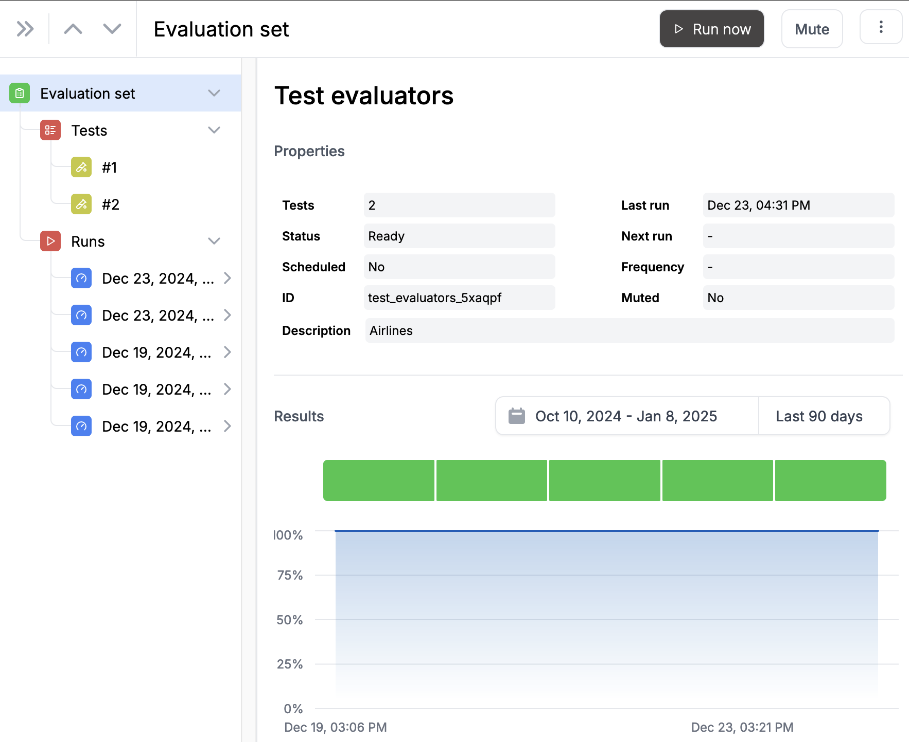

# EvaluationSets

EvaluationSets are a core feature of the NeuralTrust platform that allow you to systematically test and evaluate AI models. They provide a structured way to organize and automate collections of tests to assess model performance, safety, and compliance.

With EvaluationSets, you can:

- Create reusable test collections for consistent model evaluation
- Schedule automated evaluations to run on a regular basis (daily, weekly, etc.)
- Track model performance and safety metrics over time
- Add custom metadata to organize and categorize your EvaluationSets
- Run evaluations on-demand or automatically through the API

EvaluationSets are particularly useful for:

- Quality assurance testing of AI models
- Continuous monitoring of model behavior
- Compliance verification and documentation
- Regression testing after model updates

For more information, see the [EvaluationSets API Reference](docs/sdks/python-sdk/api-reference/evaluation-set-client.md).

## How to create an EvaluationSet manually?

You can create and manage EvaluationSets directly through the NeuralTrust web interface without needing to use the SDK:

1. Navigate to the "EvaluationSets" section in the NeuralTrust dashboard
2. Click the "Create New EvaluationSet" button
3. Fill in the basic information:
   - Name: Give your EvaluationSet a descriptive name
   - Description: Add details about the purpose and scope

Once created, you can:
- Add test cases directly through the web interface
- Edit existing test cases
- Run evaluations with a single click
- View detailed results and analytics
- Schedule automated runs

The web interface provides an intuitive way to manage your EvaluationSets while offering the same functionality as the SDK methods.
