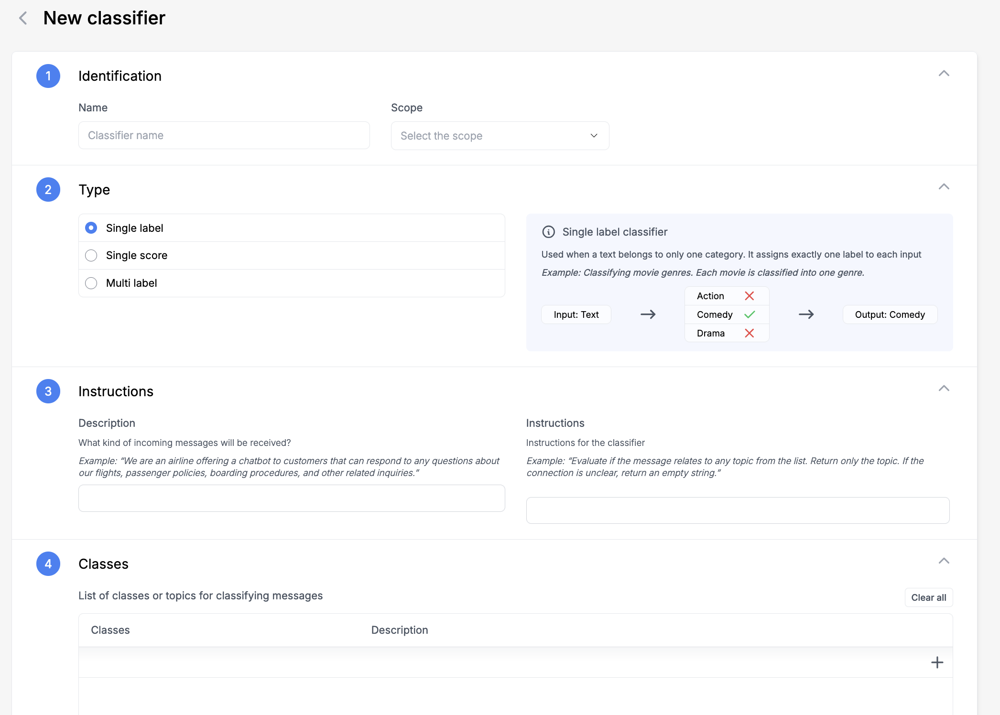

# How to create a Custom Topic Classifier?

Custom topic classifiers help you categorize conversations based on your specific business needs.

- **Create new classifier**:
  - Go to **Topics** → **Manage Topics** → **Create Topic Classifier**

- **Name and Scope**
  - Choose a descriptive name
  - Set reach: responses, answers, or both

- **Classification Type**
  - Unique label: one category per conversation
  - Multilabel: multiple categories allowed
  - Numerical: for scoring or ratings

- **Domain and Classes**
  - Define your use case (e.g., "AI customer support assistant for an e-commerce platform handling product inquiries, order management, returns, and technical support for our online shopping website and mobile app")
  - Add classes with detailed descriptions:
    ```
    Class: Product Information
    Description: Questions about product specifications, availability, pricing, comparisons, and compatibility. Includes inquiries about new arrivals, product features, and stock availability across different locations.

    Class: Order Management
    Description: Queries related to placing orders, tracking shipments, modifying existing orders, and order cancellations. Also covers payment processing issues and delivery timeframe questions.

    Class: Returns & Refunds
    Description: All conversations about product returns, refund policies, return shipping labels, refund status, and exchange procedures. Includes warranty claims and damaged item reports.

    Class: Technical Support
    Description: Website navigation issues, mobile app troubleshooting, account access problems, checkout errors, and payment gateway technical difficulties. Also covers password resets and account security concerns.

    Class: Customer Feedback
    Description: Product reviews, service quality feedback, improvement suggestions, and general comments about the shopping experience. Includes both positive feedback and complaints.
    ```

- **Save** your changes when done




:::tip
Clear class descriptions ensure better classification accuracy.
:::