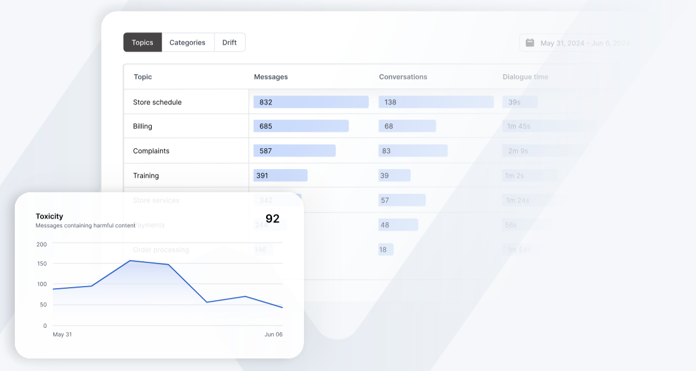

# Analytics

The Analytics dashboards provides comprehensive insights into your LLM endpoint performance, usage patterns, and security metrics. This powerful observability tool helps you monitor and optimize your AI applications across multiple dimensions.

NeuralTrust provides a wide range of metrics to help you monitor and optimize your LLM endpoint.

## Usage Metrics

Track your LLM endpoint utilization through key metrics to optimize resource allocation and understand usage patterns:

- **Total messages processed**: Monitor your application's scale and growth
- **Number of active conversations**: Understand concurrent usage and user engagement
- **Response generation time**: Track how fast your LLM responds to user queries
- **Usage patterns over time**: Identify trends and cyclical patterns
- **Peak usage periods**: Prepare for high-demand situations
- **API call frequency**: Monitor integration health and usage patterns

The current usage metrics are:
- **Number of Messages**: Total count of individual messages processed by your LLM endpoint
- **Number of Conversations**: Total count of unique chat sessions or interactions between users and the LLM
- **Dialogue volume**: Total amount of text content processed across all conversations
- **Dialogue time**: Duration of time spent in active conversations with the LLM
- **Single message rate**: Average time taken to process and respond to individual messages
- **Words per message**: Average number of words contained in each message or response
- **Language**: Distribution of languages used across all conversations

## Topic Classification Metrics

Understand conversation patterns and user needs through automated topic analysis:

- **AI-generated topic clusters**: Automatically group similar conversations
- **Conversation theme distribution**: Visualize popular discussion topics
- **Most common use cases**: Identify primary user needs
- **Topic trend analysis**: Track changing user interests over time
- **Custom topic mapping**: Define and track specific topics of interest

The metrics for each custom topic are:
- **Number of messages**: Total count of individual messages processed by your LLM endpoint
- **Number of conversations**: Total count of unique chat sessions or interactions between users and the LLM
- **Dialogue time**: Duration of time spent in active conversations with the LLM
- **Words per prompt**: Average number of words in user inputs sent to the LLM
- **Words per response**: Average number of words in responses generated by the LLM
- **Latency**: Time taken by the LLM to generate and return a response
- **Cost**: Financial expense associated with LLM API calls
- **Tokens per prompt**: Number of tokens (chunks of text) in user inputs, which directly affects API costs
- **Tokens per response**: Number of tokens in LLM-generated responses, which directly affects API costs
- **Readability**: Measure of how easy it is to understand the LLM's responses
- **+ Response sentiment**: Frequency of positive emotional tone in LLM responses
- **- Response sentiment**: Frequency of negative emotional tone in LLM responses
- **+ Prompt sentiment**: Frequency of positive emotional tone in user inputs
- **- Prompt sentiment**: Frequency of negative emotional tone in user inputs

## System Performance Metrics

Monitor and optimize your LLM deployment's technical aspects:

- **Cost per request**: Track financial efficiency
- **Average latency**: Monitor response speed
- **Token usage statistics**: Optimize prompt and response efficiency
- **Model performance metrics**: Track accuracy and quality
- **Error rates and types**: Identify and fix issues
- **Resource utilization**: Monitor system efficiency

The current system performance metrics are:
- **Calls**: Total number of API calls made to your LLM endpoint
- **Cost**: Total financial expense associated with LLM API calls
- **Average latency**: Average time taken by the LLM to generate and return a response
- **Tokens**: Total number of tokens (chunks of text) processed by the LLM
- **Tokens per message**: Average number of tokens in messages processed by the LLM

## User Metrics

Understand user behavior and improve engagement:

- **Active users count**: Track user adoption and retention
- **Session duration statistics**: Understand user engagement depth
- **User engagement metrics**: Measure interaction quality
- **Return user rates**: Monitor user loyalty
- **Platform/device usage**: Optimize for different platforms

The current user metrics are:
- **Sessions**: Total count of unique user sessions or interactions with the LLM
- **Users**: Total count of unique users who have interacted with your LLM endpoint
- **New Users**: Total count of new users who have started using your LLM endpoint
- **Sessions per user**: Average number of sessions per user
- **Sessions by country**: Distribution of sessions by country
- **Sessions by source**: Distribution of sessions by source (e.g., web, mobile, API)

## Security Metrics

Protect your LLM deployment and ensure safe usage:

- **Jailbreak attempt detection**: Identify security threats
- **Content moderation flags**: Maintain appropriate content
- **Blocked request patterns**: Understand security threats
- **Security incident trends**: Track security health

The current security metrics are:
- **Number of Prompt data leakage**: Count of instances where sensitive information might be exposed in prompts
- **Number of Prompt injection**: Count of potential malicious prompt attempts trying to manipulate the LLM's behavior

## Feedback Metrics

Track emotional context and user satisfaction:

- **Message sentiment scoring**: Understand user emotions
- **Sentiment trends over time**: Monitor changing user attitudes
- **Emotional content analysis**: Understand user emotional states
- **User satisfaction indicators**: Track experience quality
- **Response sentiment matching**: Ensure appropriate emotional responses
- **Conversation tone metrics**: Monitor interaction quality

The current feedback metrics are:
- **Number of positive sentiment**: Count of messages with positive emotional tone
- **Number of negative sentiment**: Count of messages with negative emotional tone

## Accessibility Metrics

Ensure your LLM is accessible and understandable:

- **Message complexity scores**: Monitor response clarity
- **Language level assessment**: Ensure appropriate communication level

The current accessibility metrics are:
- **Readability**: Measure of how easy it is to understand the LLM's responses, for elementary school students, middle school students, high school students, college students.
