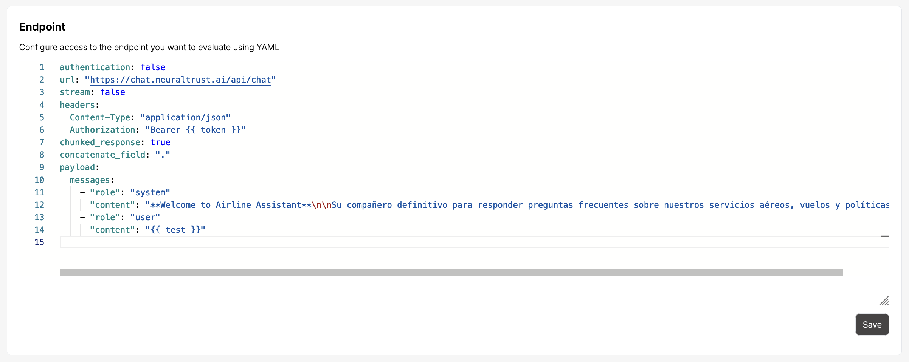

# Configure your LLM endpoint

This guide explains how to configure your LLM endpoint to invoke through NeuralTrust.

In your app go to **Configuration** -> **Evaluation**

Here you can configure your NeuralTrust to invoke your LLM and handle the responses, based on a Yaml file.



## Yaml definition

A basic Yaml file has the following structure:

```yaml
url: "http://localhost:8080/v1/chat/completions"
stream: false
headers:
  api-key: "<my key>"
  Content-Type: "application/json"
chunked_response: true
concatenate_field: "result.choices.0.message.content"
payload:
  messages:
    - role: "user"
      content: "{{ test }}"
```

Currently, we define these macros, that will be replaced with the values that are being sent to the LLM dynamically:

- `{{ test }}`: This is a simple macro that will be replaced with the value of the message that is being sent to the LLM.
- `{{ date }}`: This is a macro that will be replaced with the current date.
- `{{ token }}`: This is a macro that will be replaced with the token that is being sent to the LLM.

The Yaml file has the following structure:

```yaml
url: <string> # your API endpoint URL
headers: # your API headers
  <key>: <value>
payload: # your API payload
  <key>: <value>
authentication: <boolean> # if your API requires on the fly authentication via a token
token: # Optional, if authentication is true, this is the token request configuration
  url: <string> # the token request URL
  payload: <dictionary> # the token request payload
stream: <boolean> # if the LLM is streaming the response
chunked_response: <boolean> # if the LLM response is chunked
concatenate_field: <string> # field that will be concatenated to get the final response
content_regex: <string> # Optional, a regex to extract the content from the response
error_handling: # Optional, if you want to parse the error messages.
   - status_code: <string> # the firewall status code, like 403, 404, etc.
     concatenate_field: <string> # Optional,field that will be concatenated to get the final response
```

## Error handling

You can configure the error handling to parse the error messages from the LLM response.

If the key `error_handling` is not defined, the error response will be ignored. Any result will appear in Evaluation.

If the key `error_handling` is defined, we can define the following configurations:

```yaml
error_handling:
  - status_code: <string> # the firewall status code, like 403, 404, etc.
    concatenate_field: <string> # Optional, field that will be concatenated to get the final response
  - status_code: <string> # the firewall status code, like 403, 404, etc.
```

Or if we want to handle all error types, we can just define the `error_handling` key like:

```yaml
error_handling: "all"
```

:::warning
By default all errors are ignored. So if an Evaluation request fails, it won't appear in the UI.
:::

## Examples

### Basic LLM configuration

For example, we have a LLM endpoint that returns the following response:

```json
{
  "response": "Fine thanks."
}
```

And we need to send the request as follows:

```json
{
  "prompt": "Hello, how are you?"
}
```

We only need to send and API-key with the headers to authenticate the request. So we can configure the Yaml as follows:

```yaml
authentication: false
url: "<my llm endpoint>"
stream: false
headers:
  Content-Type: "application/json"
  Authorization: "api-key <my key>"
chunked_response: true
concatenate_field: "response"
payload:
  prompt: "{{ test }}"
```


### LLM with chunked response and firewall

For example, we have a LLM endpoint that returns the following response:

```json
{
  "result": {
    "choices": [
      {
        "message": {
          "content": "content=Hello, how are you?"
        }
      }
    ]
  }
}
```

We want to obtain only the `Hello, how are you?` from the response.

We want to parse the response from the firewall and get the content of the response. The firewall will return the following response, with **Status code 400**.

```json
{
  "errors": [
    {
      "message": "You are not allowed to access this resource"
    }
  ]
}
```

So, we can configure the Yaml as follows:

```yaml
authentication: false
url: "<my llm endpoint>"
stream: false
headers:
  api-key: "<my key>"
  Content-Type: "application/json"
chunked_response: true
concatenate_field: "result.choices.0.message.content"
content_regex: "content=([^|]+)"
error_handling:
  - status_code: 400
    concatenate_field: "errors.0.message"
payload:
  messages:
    - role: "user"
      content: "{{ test }}"
```

### LLM with token authentication

For example, we have a LLM endpoint that we need to authenticate via a token, that is generated via a request:

```json
{
  "url": "<my token request URL>",
  "auth_id": "POST",
  "secret": "<my secret>",
  "payload": {
    "data": {
      "dateTime": "{{ date }}",
      "client_id": "<my client id>",
      "service": "<my service>"
    },
    "signature": ""
  }
}
```

So, we can configure the Yaml as follows:

```yaml
authentication: true
id: aireuropa
token:
  url: "<my token request URL>"
  auth_id: "POST"
  secret: "<my secret>"
  payload:
    data:
      dateTime: "{{ date }}"
      client_id: "neuraltrust"
      service: "my-chat"
    signature: ""
url: "<my llm endpoint>"
stream: false
headers:
  Content-Type: "application/json"
  Authorization: "Bearer {{ token }}"
chunked_response: true
concatenate_field: "response"
payload:
  prompt: "{{ test }}"
```

### Complex error handling

For example, we have a LLM endpoint that returns the following response with error code 400:

```json
{
  "my_error": "You are not allowed to access this resource"
}
```

And with error code 500:

```json
Error: You are not allowed to access this resource
```

So, we can configure the Yaml as follows to handle the error code 400 and 500:

```yaml
error_handling:
  - status_code: 400
    concatenate_field: "my_error"
  - status_code: 500
```

In this case, the error 400 and 500 won't be ignored, and the error 400 we will get the `my_error` field from the response. 
The error 500 we will get the complete error message.